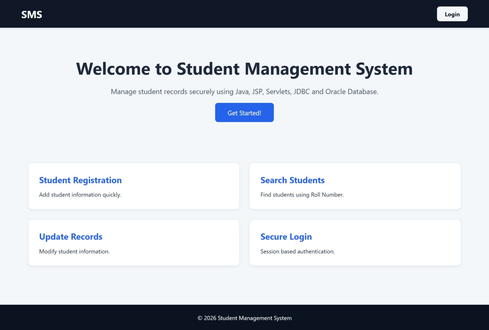
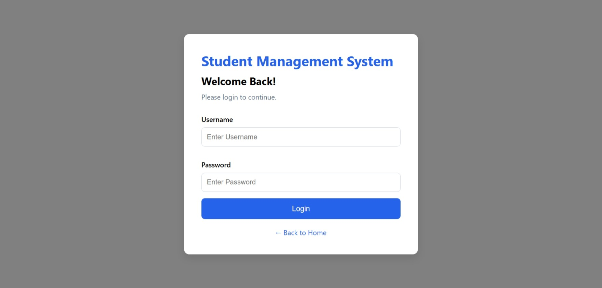
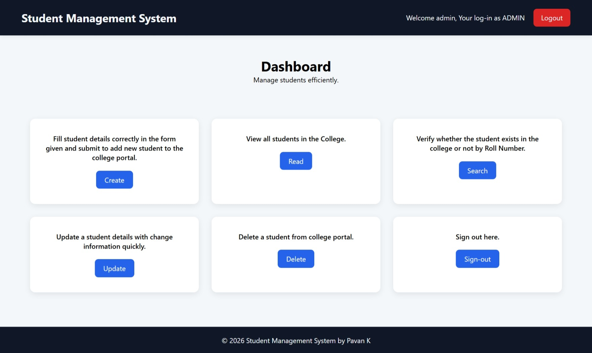
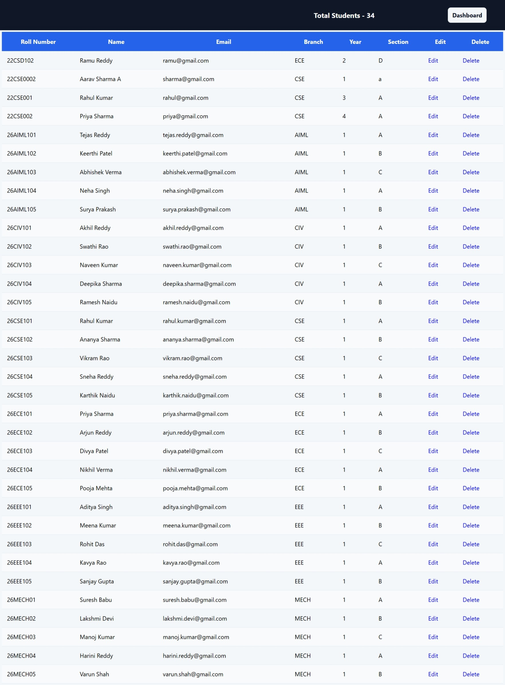
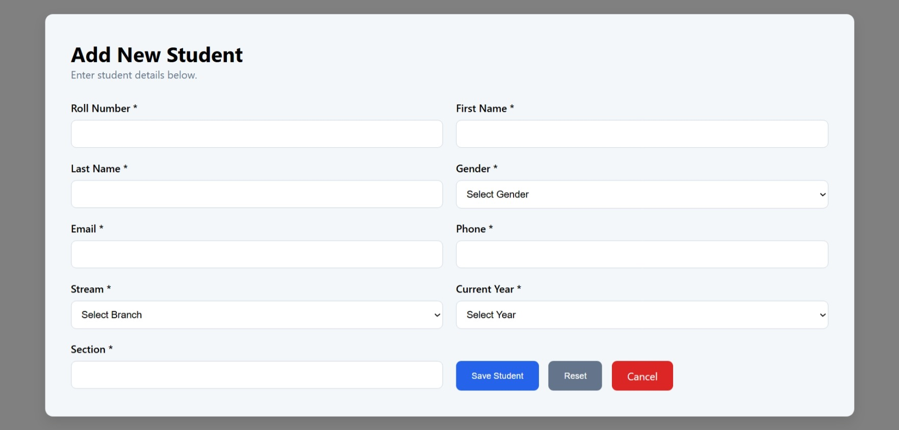
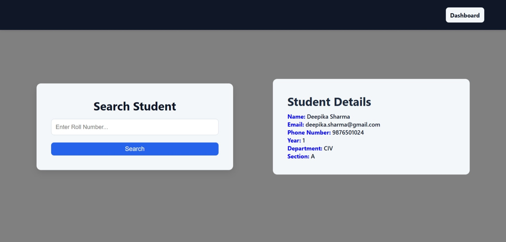
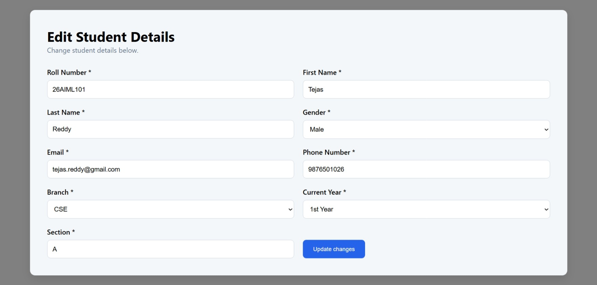

# Student Management System

A web-based student management system built with Java, JSP, Servlets, JDBC, Maven, and Oracle Database.


---

## 📖 Project Description

Student Management System is a web-based application designed to simplify and manage student records through a centralized platform. The application provides secure authentication, and efficient student record management with CRUD operations.

The system allows authorized users to add, view, update, delete, and search student records. Session management, input validation, exception handling, and centralized logging are implemented to improve application security, reliability, and maintainability.

The application follows the MVC architecture and uses the DAO design pattern to separate presentation, business, and data-access responsibilities.

### Project Highlights

- Secure user authentication and session management
- Complete student CRUD operations
- Student search
- Oracle database integration using JDBC
- MVC architecture with DAO design pattern
- Input validation and exception handling
- Centralized application logging
- Maven-based project management
- Responsive and user-friendly interface

## ✨ Features

### 🔐 Authentication & Authorization

- Secure user login and logout
- Session-based authentication
- Protected application pages using authentication filters

### 👨‍🎓 Student Management

- Add new student records
- View student details
- Update existing student records
- Delete student records
- Search students by relevant information

### 📊 Dashboard

- Centralized application dashboard
- Quick access to major student management operations

### 🛡️ Security & Reliability

- Input validation
- PreparedStatement-based database operations
- Exception handling
- Centralized application logging
- Externalized database configuration

### 🎨 User Interface

- Responsive JSP-based interface
- Consistent navigation and layouts
- User-friendly forms
- Confirmation messages for important actions
- Clean and consistent UI design

## 🛠️ Technology Stack

| Technology | Purpose |
|------------|---------|
| **Java 17** | Core application development and backend logic |
| **JSP** | Dynamic web page development |
| **Servlets** | Request handling and controller logic |
| **JDBC** | Database connectivity and SQL operations |
| **Oracle Database** | Relational database for storing application data |
| **Maven** | Dependency management and project build automation |
| **Apache Tomcat 9** | Servlet container and web application server |
| **HTML5** | Web page structure |
| **CSS3** | User interface styling and responsive layouts |
| **JavaScript** | Client-side interactions and validations |
| **Git** | Version control |
| **GitHub** | Source code management and project collaboration |

## 🏗️ Architecture Diagram

The following diagram shows the high-level architecture of the Student Management System.


## 🗄️ Database Schema

The application uses Oracle Database to store user authentication details and student records. JDBC is used to establish the database connection and execute SQL operations through the DAO layer.

### USERS Table

| Column | Data Type | Description |
|--------|-----------|-------------|
| `USERNAME` | VARCHAR2 | User login name |
| `PASSWORD` | VARCHAR2 | Stored user password |
| `ROLE` | VARCHAR2 | User authorization role |

### STUDENT Table

| Column | Data Type | Description |
|--------|-----------|-------------|
| `ROLL_NO` | VARCHAR2 | Unique student roll number |
| `FIRST_NAME` | VARCHAR2 | Student first name |
| `LAST_NAME` | VARCHAR2 | Student last name |
| `PHONE` | NUMBER | Student phone number |
| `EMAIL` | VARCHAR2 | Student email address |
| `GENDER` | VARCHAR2 | Student gender |
| `BRANCH` | VARCHAR2 | Student branch |
| `YEAR` | NUMBER | Student academic year |
| `SECTION` | VARCHAR2 | Student section |

### Database Structure

```text
Oracle Database
├── USERS
│   ├── USER_ID
│   ├── USERNAME
│   ├── PASSWORD
│   └── ROLE
│
└── STUDENT
    ├── ROLL_NO
    ├── FIRST_NAME
    ├── LAST_NAME
    ├── PHONE
    ├── EMAIL
    ├── GENDER
    ├── BRANCH
    ├── YEAR
    └── SECTION
```


## 🚀 Installation Guide

### Prerequisites

Make sure the following are installed before running the application:

- Java 17 or later
- Apache Maven
- Oracle Database
- Apache Tomcat 9
- Git
- A web browser

### 1. Clone the Repository

```bash
git clone <YOUR_GITHUB_REPOSITORY_URL>
cd student-management-system
```

### 2. Configure the Oracle Database

1. Start your Oracle Database instance.
2. Create the required database user/schema.
3. Open the SQL script located in:

```text
database/student_management.sql
```

## Step 5 — Configure Database Credentials

### 3. Configure Database Credentials

Configure the database connection using your local configuration file.

## Step 6 — Build the Maven Project

### 4. Build the Application

From the project root, run:

```bash
mvn clean package
```

## Step 7 — Deploy to Tomcat

### 5. Deploy to Apache Tomcat

Copy the generated WAR file into the Tomcat `webapps` directory:

```text
apache-tomcat-9.x.x/webapps/
```

## Step 8 — Open the Application

### 6. Run the Application

Open your browser and navigate to:

```text
http://localhost:8080/<APPLICATION_CONTEXT_PATH>/
```

## Step 9 — Login

### 7. Login

Use the demo account configured for the application.

### Troubleshooting

**Maven build fails**

Verify that Java 17 and Maven are installed and configured correctly.

```bash
java -version
mvn -version
```

## 📸 Screenshots

### Home Page



### Login



### Dashboard



### Student Management



### Add Student



### Search Student



### Edit Student



## 📁 Project Structure

```text
student-management-system/
├── src/
│   └── main/
│       ├── java/
│       │   └── ...
│       └── webapp/
│           ├── WEB-INF/
│           │   └── web.xml
│           ├── css/
│           └── js/
│
├── database/
│   └── student_management.sql
│
├── docs/
│   └── architecture.png
│
├── screenshots/
│   ├── home.png
│   ├── login.png
│   ├── dashboard.png
│   ├── student-list.png
│   ├── add-student.png
│   └── edit-student.png
│
├── .gitignore
├── pom.xml
└── README.md

src/main/java/
└── com/student/
    ├── controller/
    │   ├── LoginServlet.java
    │   ├── LogoutServlet.java
    │   └── StudentServlet.java
    │
    ├── dao/
    │   ├── UserDAO.java
    │   └── StudentDAO.java
    │
    ├── model/
    │   ├── User.java
    │   └── Student.java
    │
    └── util/
        └── DBConnection.java
```

### Directory Overview

| Directory/File | Purpose |
|----------------|---------|
| `src/main/java` | Java source code for application logic |
| `controller` | Handles HTTP requests through Servlets |
| `dao` | Handles database operations |
| `model` | Represents application data/entities |
| `util` | Contains reusable utility classes such as database connection handling |
| `src/main/webapp` | JSP pages and web resources |
| `WEB-INF` | Protected web application configuration |
| `database` | Database schema and setup scripts |
| `docs` | Project documentation and architecture diagrams |
| `screenshots` | Application screenshots used in the README |
| `pom.xml` | Maven project configuration and dependencies |
| `.gitignore` | Prevents unwanted files and secrets from being committed |

## 🔮 Future Enhancements

The project can be further enhanced with the following features:

- Centralized logging using Log4j2
- Password hashing and stronger authentication mechanisms
- Automated unit and integration testing using JUnit and Mockito
- Advanced student filtering and sorting
- Student profile and document management
- Export student records to PDF or Excel
- Email notifications for important student updates
- REST API integration for external applications
- Docker-based application deployment
- CI/CD pipeline for automated build and deployment
- Production monitoring and centralized logging

## 🤝 Contributing

Contributions, suggestions, and improvements are welcome.

To contribute:

1. Fork the repository.
2. Clone your fork locally.
3. Create a new feature branch.
4. Make your changes and test them locally.
5. Commit your changes with a clear commit message.
6. Push the branch to your fork.
7. Open a Pull Request describing your changes.

Please ensure that your changes follow the existing project structure and coding conventions.

### Example Workflow

```bash
git clone <YOUR_FORK_URL>
cd student-management-system

git checkout -b feature/your-feature

git add .
git commit -m "Add your feature"

git push origin feature/your-feature
```

### Contribution Guidelines

- Keep changes focused and related to the proposed feature or fix.
- Follow the existing Java coding style.
- Do not commit database passwords, credentials, API keys, or other sensitive information.
- Test changes before submitting a Pull Request.
- Use clear and descriptive commit messages.

## 📄 License

This project is licensed under the [MIT License](LICENSE).

## 💡 Key Technical Highlights

- Developed a Java-based web application using JSP and Servlets.
- Implemented CRUD operations for student record management.
- Integrated Oracle Database using JDBC and the DAO design pattern.
- Implemented session-based authentication and role-based access control.
- Added search and pagination for efficient student record management.
- Used Maven for dependency management and application builds.
- Designed the application using a structured MVC-based architecture.
- Implemented input validation and exception handling for reliable application behavior.

## 🎯 Skills Demonstrated

**Backend Development:** Java, Servlets, JDBC, DAO

**Web Development:** JSP, HTML, CSS, JavaScript

**Database:** Oracle SQL, Database Design

**Software Engineering:** MVC Architecture, Exception Handling, Session Management

**Build & Version Control:** Maven, Git, GitHub

## 👨‍💻 My Contribution

Designed and developed the application end-to-end, including the JSP-based user interface, Servlet controllers, DAO layer, JDBC database integration, authentication and session management, student CRUD operations, search, and Maven-based project configuration.

## 🔗 Project Repository

[View the source code on GitHub](https://github.com/KPAVANTEJA/student-management-system-javaee.git)