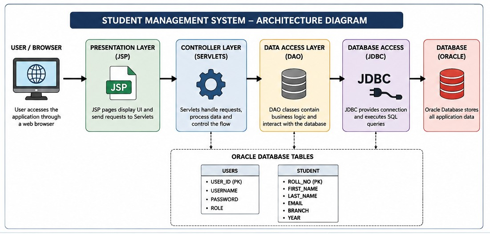

# Student Management System

A web-based student management system built with Java, JSP, Servlets, JDBC, Maven, and Oracle Database.

---

## 📖 Project Description

Student Management System is a web-based application designed to simplify and manage student records through a centralized platform. The application provides secure authentication, and efficient student record management with CRUD operations.

The system allows authorized users to add, view, update, delete, and search student records. Session management, input validation, exception handling, and centralized logging are implemented to improve application security, reliability, and maintainability.

The application follows the MVC architecture and uses the DAO design pattern to separate presentation, business, and data-access responsibilities.

### Project Highlights

- Secure user authentication and session management
- Complete student CRUD operations
- Student search
- Oracle database integration using JDBC
- MVC architecture with DAO design pattern
- Input validation and exception handling
- Centralized application logging
- Maven-based project management
- Responsive and user-friendly interface

## ✨ Features

### 🔐 Authentication & Authorization

- Secure user login and logout
- Session-based authentication
- Protected application pages using authentication filters

### 👨‍🎓 Student Management

- Add new student records
- View student details
- Update existing student records
- Delete student records
- Search students by relevant information

### 📊 Dashboard

- Centralized application dashboard
- Quick access to major student management operations

### 🛡️ Security & Reliability

- Input validation
- PreparedStatement-based database operations
- Exception handling
- Centralized application logging
- Externalized database configuration

### 🎨 User Interface

- Responsive JSP-based interface
- Consistent navigation and layouts
- User-friendly forms
- Confirmation messages for important actions
- Clean and consistent UI design

## 🛠️ Technology Stack

| Technology | Purpose |
|------------|---------|
| **Java 17** | Core application development and backend logic |
| **JSP** | Dynamic web page development |
| **Servlets** | Request handling and controller logic |
| **JDBC** | Database connectivity and SQL operations |
| **Oracle Database** | Relational database for storing application data |
| **Maven** | Dependency management and project build automation |
| **Apache Tomcat 9** | Servlet container and web application server |
| **HTML5** | Web page structure |
| **CSS3** | User interface styling and responsive layouts |
| **JavaScript** | Client-side interactions and validations |
| **Git** | Version control |
| **GitHub** | Source code management and project collaboration |

## 🏗️ Architecture Diagram

The following diagram shows the high-level architecture of the Student Management System.

